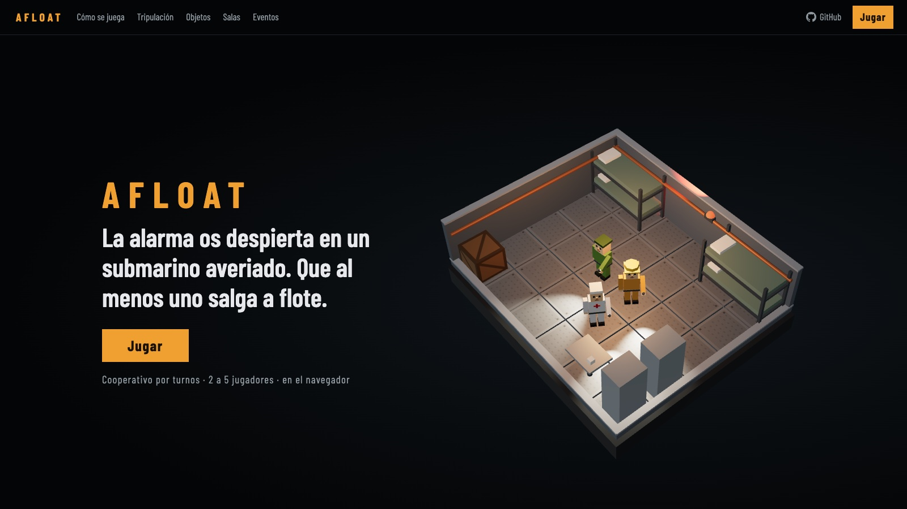
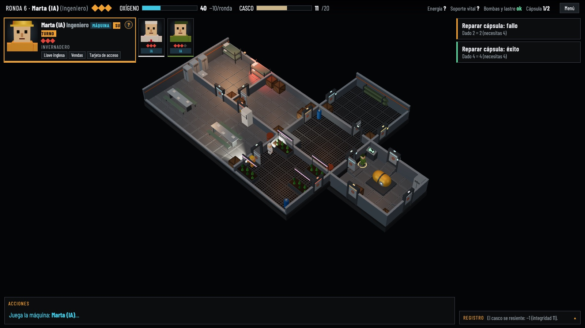
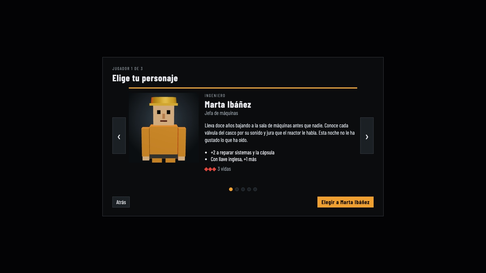
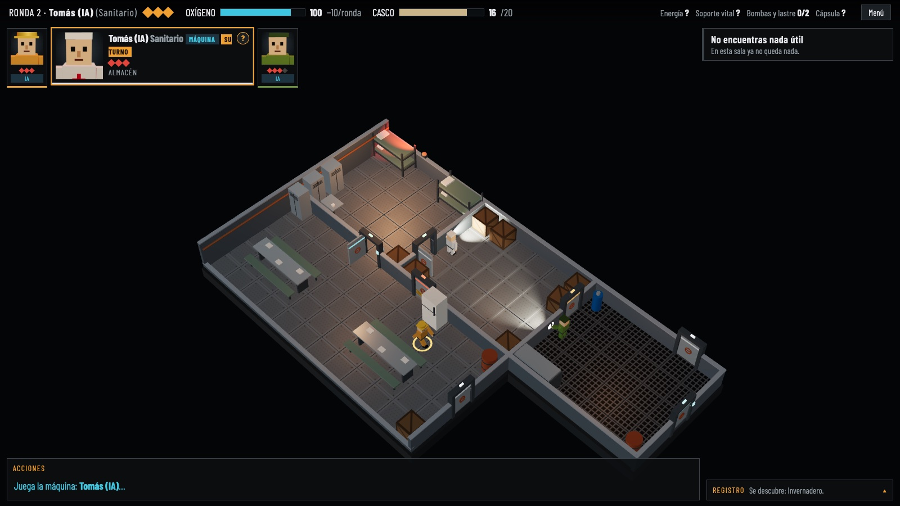
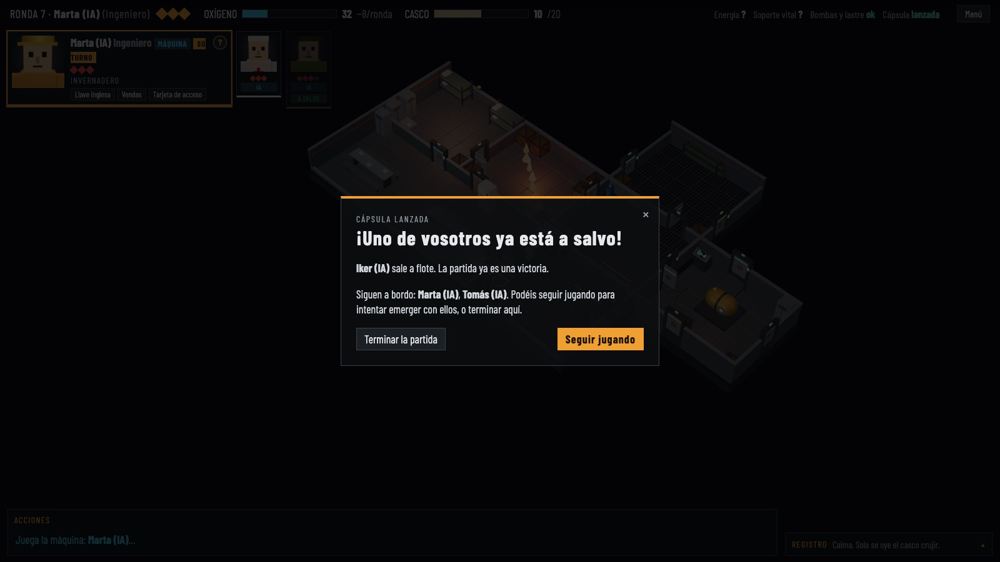

# AFLOAT

**Juego cooperativo por turnos para navegador, de 2 a 5 jugadores, en un submarino averiado, a oscuras y distinto en cada partida.**

🎮 **Jugar:** https://afloat.polmarza.workers.dev
🎬 **Vídeo de una partida:** [docs/media/afloat-partida-maquinas.mp4](docs/media/afloat-partida-maquinas.mp4)

[](https://afloat.polmarza.workers.dev)

Una alarma os despierta dentro de un submarino que se hunde. Las salas están a oscuras hasta que alguien abre la puerta, el oxígeno es común y se acaba. El equipo gana si **al menos un tripulante sale a flote**, así que habrá que repartir recursos y, a veces, sacrificar a alguien.

## Cómo se juega

- **Tripulación de 2 a 5**, cada plaza humana o de la máquina.
- **Online o en un mismo ordenador:** crea una sala, pasa el código o el enlace por Discord y cada uno juega desde su casa. También se puede jugar en un solo PC pasándose el turno, o solo contra la máquina.
- **5 roles** con habilidades propias: ingeniero, sanitario, militar, informático y buzo.
- **Submarino aleatorio** en cada partida, siempre con salida alcanzable. Se puede repetir un mapa con su semilla.
- **Niebla de guerra:** solo está iluminada la sala inicial. Las demás se descubren al abrir su puerta.
- **Rondas de tres fases:** crisis, turnos de la tripulación y consecuencias.
- **Tres acciones por turno:** moverse, abrir puertas (cinco tipos), buscar, reparar, curar, dar y usar objetos.
- **Tiradas de 1d6** con modificadores de rol y objeto.
- **Tres sistemas que reparar:** energía, soporte vital y bombas.
- **Dos salidas:** cápsula de escape (una plaza) o emerger el submarino.
- **Salas especiales:** invernadero, laboratorio y cantina.
- **Tres dificultades** y puntuación con desglose. Los récords se guardan en el navegador.



| Cinco tripulantes | Exploración | La cápsula |
|---|---|---|
|  |  |  |
| Cada uno con su rol y su historia. | Cada puerta abierta descubre una sala nueva. | Salva a uno; el resto puede intentar emerger. |

## Estado

Jugable de principio a fin en local y online (salas privadas con código), con una portada que explica el juego, la tripulación, los objetos, las salas y los eventos. Lo siguiente es el ranking online. Consulta el [roadmap](docs/roadmap.md).

## Desarrollo

Requiere Node.js y npm.

```bash
npm install
npm run dev        # web en http://localhost:5173 + servidor de salas online
npm test           # tests del motor, de la IA y de las salas
npm run typecheck  # comprobar tipos de todos los paquetes
npm run build      # compilar el cliente
npm run deploy     # compilar y publicar la web y las salas en Cloudflare (requiere wrangler login)
```

## Cómo está hecho

- **TypeScript** estricto, **three.js**, **Vite** y **Vitest**, en un monorepo de npm.
- `packages/shared`: motor de reglas puro (`applyAction(state, action) → { state, events }`), contenido, balance e IA. No depende del navegador y toda la aleatoriedad pasa por un RNG con semilla.
- `packages/client`: cliente three.js y HUD. Lee el estado y reproduce los sucesos, nunca decide reglas.
- `packages/server`: un Cloudflare Worker con un Durable Object por sala online, que ejecuta el mismo motor y juega las máquinas.
- **Arte 100 % generado por código** (geometría low-poly y texturas en canvas), sin assets de terceros. Estilo industrial oscuro.
- Alojado en Cloudflare: un solo Worker sirve la página y las salas (Durable Objects con SQLite, plan gratuito).

## Documentación

| Documento | Contenido |
|---|---|
| [docs/prd.md](docs/prd.md) | Qué es el juego y sus reglas |
| [docs/architecture.md](docs/architecture.md) | Cómo está construido |
| [docs/data-model.md](docs/data-model.md) | Tipos y valores |
| [docs/design-system.md](docs/design-system.md) | Estilo visual |
| [docs/roadmap.md](docs/roadmap.md) | Fases y estado |
| [docs/credits.md](docs/credits.md) | Créditos y licencias |
| [openspec/specs](openspec/specs) | Especificación de cada dominio (reglas, portada, salas online) |

## Licencia

[MIT](LICENSE).
