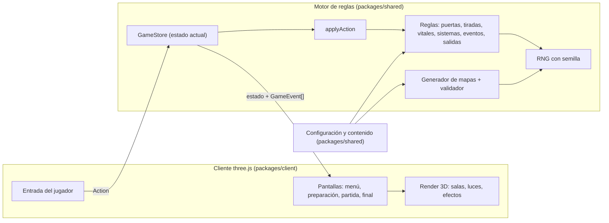

# Arquitectura — AFLOAT

Qué hace el juego está en `docs/prd.md`; aquí solo se describe **cómo** se construye.

## Stack

| Pieza | Elección | Por qué |
|---|---|---|
| Lenguaje | TypeScript (modo estricto) | Tipos para el estado del juego; el mismo código servirá en el servidor en la fase 2 |
| Motor gráfico | three.js | 3D en el navegador con luces y sombras reales (linternas, alarma, oscuridad); permite construir todo el arte por código, sin assets de terceros |
| Herramienta de build | Vite | Arranque instantáneo en local, recarga en caliente |
| Tests | Vitest | Rápido, integrado con Vite; se usa sobre el motor de reglas |
| Gestor de paquetes | npm (workspaces) | Por defecto con Node; un paquete `shared` con el motor y otro `client`, y luego `server` |

**Fase 2 (online)**: servidor autoritativo que ejecuta el mismo motor de reglas dentro de un Cloudflare Durable Object por sala (WebSocket). Sin cuentas: nombre y código de sala (Clerk más adelante). El cliente habla con una `Session`: `LocalSession` (en este ordenador) o `RemoteSession` (online). **Hecho**: salas privadas con código y ranking online en Cloudflare D1.

## Principio central: motor de reglas puro

El juego se divide en dos mundos que **no se mezclan**:

1. **Motor de reglas (`packages/shared/src/engine`)**: TypeScript puro. Sin three.js, sin DOM, sin `Math.random`, sin temporizadores. Recibe un estado y una acción y devuelve el nuevo estado más una lista de sucesos (para animar y registrar).

   ```ts
   applyAction(state: GameState, action: Action): { state: GameState; events: GameEvent[] }
   ```

2. **Cliente (`packages/client/src/game`)**: three.js. Dibuja el estado, reproduce los sucesos como animaciones y traduce los clics del jugador en acciones.

Así, en la fase 2 el motor se mueve al servidor y el cliente sigue funcionando igual: solo cambia quién ejecuta `applyAction`.

## Diagrama de componentes



En la fase 2, la flecha "Action" viaja por red al servidor y la flecha de estado vuelve por red; el resto no cambia.

## Estructura de carpetas

El proyecto es un monorepo de npm con paquetes (`packages/*`). El motor vive en un paquete aparte (`shared`) para que el navegador y, en la fase 2, el servidor ejecuten **exactamente el mismo código**.

```
survemarine/                   (carpeta del proyecto; el juego se llama AFLOAT)
├── CLAUDE.md
├── docs/                      Especificación (este documento y hermanos)
├── openspec/                  Specs funcionales (OpenSpec)
├── package.json               Raíz: define los paquetes y los comandos (dev, build, test, deploy)
├── tsconfig.base.json         Opciones de TypeScript comunes
└── packages/
    ├── shared/                @afloat/shared — TypeScript puro, SIN DOM ni three.js
    │   ├── tsconfig.json      Sin tipos de navegador: si el motor usa `window`, no compila
    │   ├── src/
    │   │   ├── config/balance.ts   TODOS los números de equilibrio (+ tamaño de módulo ROOM_W×ROOM_D)
    │   │   ├── content/            Datos: roles, personajes, objetos, eventos, salas, dificultad
    │   │   ├── ai/bot.ts           IA clásica de los tripulantes de la máquina
    │   │   ├── net/protocol.ts     Mensajes entre navegador y servidor de salas, y la sala vista por ambos
    │   │   └── engine/             Motor de reglas puro (sin Math.random)
    │   │       ├── index.ts        API pública: createGame, applyAction, replay, scoreGame, successChance…
    │   │       ├── types.ts        GameState, Action, GameEvent…
    │   │       ├── setup.ts        createGame: genera el mapa, coloca a la tripulación, ronda 1
    │   │       ├── applyAction.ts  Punto de entrada único de las reglas
    │   │       ├── context.ts      Copia de trabajo del estado + RNG + sucesos + log
    │   │       ├── rng.ts          Generador pseudoaleatorio con semilla (mulberry32)
    │   │       ├── phases.ts       Crisis → Tripulación → Consecuencias
    │   │       ├── replay.ts       Reconstruye una partida a partir de su configuración y sus acciones
    │   │       ├── rules/          dice, doors, movement, items, systems, vitals, events, escape,
    │   │       │                   rooms (invernadero, laboratorio, cantina), score (puntuación final)
    │   │       └── mapgen/         generate.ts (módulos + cantina doble + puertas + objetos), validate.ts
    │   └── tests/                  engine/ (reglas, generador, puntuación) y ai/ (bots)
    └── client/                @afloat/client — navegador: three.js + HUD en HTML
        ├── index.html         Lienzo 3D + HUD en HTML
        ├── vite.config.ts
        └── src/
            ├── main.ts        Arranque
            └── game/
                ├── App.ts         Controlador: envía acciones a la sesión, anima los sucesos, cámara, entrada
                ├── session.ts     Session: dónde vive el estado y por dónde llegan las acciones aceptadas. LocalSession (este ordenador)
                ├── online/        remoteSession.ts (RemoteSession: WebSocket, reconexión), identity.ts (clave y nombre del navegador)
                ├── world.ts       Vista 3D del barco a partir del GameState (salas, puertas, agua, fuego, luz)
                ├── roomProps.ts   Mobiliario por tipo de sala (sin bloquear puertas)
                ├── props.ts       Mobiliario low-poly generado por código
                ├── crew.ts        Tripulantes low-poly con linterna
                ├── materials.ts   Materiales y texturas procedurales
                ├── styles.ts      Estilo visual: paleta y luces (industrial oscuro)
                ├── tweens.ts      Animaciones
                ├── records.ts     Tabla de récords en localStorage (con acciones para poder reproducirlas)
                ├── vignette.ts    Escenas 3D pequeñas de la portada (salas reales animadas por un guion)
                └── ui/            landing.ts y landingScenes.ts (portada), online.ts (modo de juego, crear/unirse, sala de espera), setup.ts (preparación), hud.ts (paneles, avisos, pantalla final),
                                   options.ts (acciones disponibles), sheet.ts (fichas, resumen, menú, récords), modal.ts
```

    └── server/                @afloat/server — Cloudflare Worker: sirve la página y las salas online
        ├── wrangler.jsonc     Worker "afloat": assets del cliente + Durable Object RoomObject (SQLite) + D1 `afloat` (binding DB)
        ├── src/
        │   ├── index.ts       Rutas (/api/rooms, /api/rooms/:code/ws, resto → página) y RoomObject (sockets con hibernación, almacenamiento, alarmas)
        │   ├── room.ts        Room: lógica pura de la sala (asientos, anfitrión, personajes, partida, máquinas, desconexiones)
        │   ├── ranking.ts     Ranking en D1: guardar partidas que puntúan, clasificaciones y puestos
        │   └── config.ts      Tiempos del servidor (ritmo de las máquinas, caducidad de salas vacías)
        ├── migrations/        SQL de la D1 `afloat` (tablas del ranking)
        └── tests/             room.test.ts, ranking.test.ts (con una D1 de prueba sobre la SQLite de Node)

## Partidas online

- El servidor es el único que ejecuta `applyAction` en una partida online. El navegador envía acciones y recibe cada acción aceptada (de cualquiera) con sus sucesos y el estado nuevo, numeradas; si falta una, pide el estado completo.
- `App` anima todo lo que llega por `Session.onResult` en una cola, igual en local que online. `Session.controls(id)` dice qué tripulantes maneja este navegador; fuera de tu turno la entrada está bloqueada.
- Las máquinas las juega el servidor, con una pausa que depende de cuántos sucesos tenga que animar el cliente.
- El servidor envía el estado completo, incluido lo oculto (y la semilla). Con el ranking, alguien con conocimientos podría mirarlo para hacer trampa; se acepta para un ranking entre amigos (decisión del usuario, 2026-10-02).
- **Ranking**: al terminar una partida online que empezó con todos humanos, la sala calcula `scoreGame` y `ranking.ts` la guarda en D1 (partida con su configuración y acciones, jugadores, y suma de total y mejor partida por jugador). Los jugadores se guardan por la huella SHA-256 de su clave. `GET /api/ranking?me=<huella>` da el top 20 de cada clasificación.
- Coste: Durable Objects con SQLite en el plan gratuito de Workers; si se superan los límites diarios, las operaciones fallan en vez de cobrarse.

Los imports del cliente al motor usan subrutas: `@afloat/shared/engine`, `@afloat/shared/content/items`, `@afloat/shared/config/balance`, `@afloat/shared/ai/bot`.

## Flujo de una acción

1. El jugador hace clic en una puerta y en "Hackear".
2. `GameScene` crea `{ type: 'OPEN_DOOR', playerId, doorId }` y la envía al `GameStore`.
3. `applyAction` valida (¿es su turno? ¿le quedan acciones? ¿está en esa sala?), tira el dado con el RNG, aplica el resultado y devuelve el nuevo estado y los sucesos (`DiceRolled`, `DoorOpened`, `RoomRevealed`).
4. El `GameStore` guarda el estado y notifica.
5. `animations.ts` reproduce los sucesos en orden (dado, puerta abriéndose, sala iluminándose) y el HUD se actualiza.

Una acción inválida devuelve el mismo estado y un suceso `ActionRejected` con el motivo, que el HUD muestra.

## Arte generado por código

- No hay assets de terceros: geometría low-poly (cajas, cilindros, anillos) y texturas pequeñas dibujadas en un `<canvas>` (chapas, rejillas, franjas de peligro, pantallas).
- Cada mueble es una función en `props.ts`; el estilo visual (colores, materiales, luces) vive en `styles.ts`.
- Las paredes que miran a la cámara se bajan automáticamente (vista "en corte" tipo diorama) al girar la cámara.
- Las salas no descubiertas no se dibujan; al descubrirlas se "montan" casilla a casilla desde la puerta.

## Notas de three.js

- Luces físicas: la intensidad de una luz puntual cae con la distancia al cuadrado. Los colores base demasiado oscuros se ven negros aunque haya luz; la oscuridad se consigue con poca luz, no con colores oscuros.
- Los materiales metálicos necesitan algo que reflejar: se usa un `RoomEnvironment` suave (`scene.environmentIntensity` por estilo).
- **Luces y rendimiento** (probado en una gráfica integrada Intel UHD 630):
  - Cada luz se calcula en cada píxel, así que hay pocas y fijas: un grupo de 6 luces de techo y 2 de incendio que se asignan a las salas descubiertas más cercanas al jugador activo.
  - Solo una linterna proyecta sombras: una luz compartida que sigue al jugador activo. Las linternas del resto iluminan sin sombra.
  - Las luces nunca se ocultan ni se añaden durante la partida, solo cambian de intensidad: cambiar el número de luces obliga a recompilar todos los shaders y provoca un tirón visible.
  - Al empezar la partida se precompilan todos los materiales (`World.precompile`).
  - La densidad de píxeles está limitada a 1,5.
- El agua no recibe reflejos del entorno (`envMapIntensity: 0`): solo brilla con las luces directas, como la linterna.

## Aleatoriedad

- Un único RNG con semilla (por ejemplo mulberry32 o sfc32) guardado **dentro** del estado.
- Generación de mapa, mazos y tiradas lo usan. Prohibido `Math.random` en el motor (`packages/shared`).
- La misma semilla y las mismas acciones reproducen la partida exacta (útil para depurar y, en la fase 2, para verificar sincronía).

## Integraciones y dependencias externas

- **MVP**: ninguna. Todo funciona sin conexión tras cargar la página.
- **Fuentes**: Barlow Condensed (Google Fonts) para el HUD del prototipo.
- **Assets**: ninguno de terceros; todo el arte se genera por código.
- **Fase 2**: Cloudflare Durable Objects (una sala por partida, WebSocket).
- **Fase 3**: Discord Embedded App SDK (Activities), opcional.

## Autenticación

- **MVP**: ninguna. Los jugadores escriben su nombre al preparar la partida.
- **Fase 2**: sin cuentas; salas identificadas por un código o enlace (`?sala=CÓDIGO`), con el nombre como identidad y una clave secreta por navegador (`localStorage`) para recuperar tu asiento al reconectar.

## Despliegue

- **Desarrollo**: `npm run dev` arranca Vite (`http://localhost:5173`) y el Worker con `wrangler dev` (puerto 8787) a la vez; Vite reenvía `/api` (también el WebSocket) al Worker. `npm run dev:web` arranca solo la web.
- **Publicado en Cloudflare**: https://afloat.polmarza.workers.dev. Un solo Worker (`afloat`) sirve la página y las salas online. Se actualiza con `npm run deploy` (compila el cliente y despliega `packages/server/wrangler.jsonc`; usa la sesión de `wrangler login`). Dominio propio pendiente.
- **Build estático**: `npm run build` genera `dist/`, publicable en cualquier hosting estático si se quiere compartir la versión local.
- **Fase 2**: hecho con el mismo Worker (página + salas).
