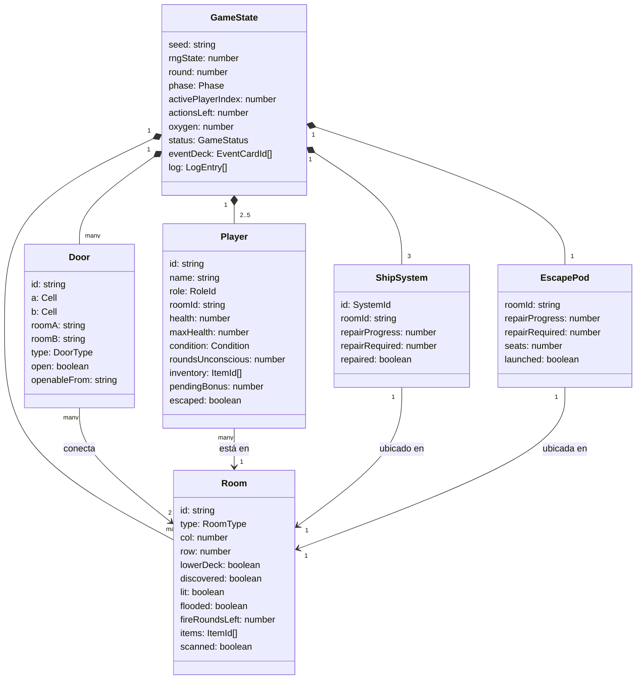

# Modelo de datos — AFLOAT

El MVP **no tiene base de datos**. El "modelo de datos" es el estado de la partida en memoria (`packages/shared/src/engine/types.ts`), más el contenido estático (`packages/shared/src/content`) y la configuración de equilibrio (`packages/shared/src/config/balance.ts`).

El estado debe ser **serializable a JSON** (sin clases, funciones ni referencias circulares) para poder enviarlo por red en la fase 2. Las relaciones se expresan con identificadores (`roomId`, `doorId`…), no con referencias a objetos.

## Diagrama



## Entidades

### GameState
| Campo | Tipo | Descripción |
|---|---|---|
| `seed` | `string` | Semilla de la partida |
| `difficulty` | `'easy' \| 'normal' \| 'hard'` | Nivel: tamaño del submarino y multiplicador de puntos |
| `rngState` | `number` | Estado interno del RNG (avanza con cada uso) |
| `round` | `number` | Ronda actual, empieza en 1 |
| `phase` | `'crisis' \| 'crew' \| 'consequences'` | Fase de la ronda |
| `activePlayerIndex` | `number` | Jugador con el turno (fase `crew`) |
| `actionsLeft` | `number` | Acciones restantes del jugador activo |
| `oxygen` | `number` | Oxígeno común |
| `hull` | `number` | Integridad del casco (a 0 cede) |
| `status` | `'setup' \| 'playing' \| 'won' \| 'lost'` | Estado global |
| `players` | `Player[]` | Tripulación, en orden de turno |
| `rooms` | `Record<string, Room>` | Salas por id |
| `doors` | `Record<string, Door>` | Puertas por id |
| `systems` | `Record<SystemId, ShipSystem>` | Energía, soporte vital, bombas |
| `escapePod` | `EscapePod` | Cápsula de escape |
| `labCrafts` | `number` | Fabricaciones con éxito en el laboratorio (máximo 2 por partida) |
| `surfaced` | `boolean` | Emergieron con el submarino (bonus de puntuación) |
| `eventDeck` / `eventDiscard` | `EventCardId[]` | Mazo de eventos (se rebaraja al agotarse) |
| `log` | `LogEntry[]` | Historial legible de la partida |

### Player
| Campo | Tipo | Descripción |
|---|---|---|
| `id`, `name` | `string` | Identidad |
| `role` | `'engineer' \| 'medic' \| 'soldier' \| 'hacker' \| 'diver'` | Rol |
| `roomId` | `string` | Sala actual |
| `health` / `maxHealth` | `number` | Vidas actuales y máximas |
| `condition` | `'ok' \| 'unconscious' \| 'dead'` | Estado |
| `roundsUnconscious` | `number` | Rondas inconsciente (muere al superar el límite) |
| `inventory` | `ItemId[]` | Objetos |
| `pendingBonus` | `number` | Bonificación a la siguiente tirada (cigarrillos) |
| `escaped` | `boolean` | Ha salido a flote |
| `bot` | `boolean` | Lo controla la máquina |
| `rested` | `boolean` | Ya comió y descansó en la cantina (una vez por partida) |

### Room
| Campo | Tipo | Descripción |
|---|---|---|
| `id` | `string` | Identificador |
| `type` | `RoomType` | `quarters`, `bridge`, `engine`, `life_support`, `pumps`, `escape_pod`, `cantina`, `greenhouse`, `lab`, `infirmary`, `storage`, `torpedo`, `corridor` |
| `col`, `row` | `number` | Módulo de la rejilla (el más al oeste en salas dobles) |
| `span` | `number` | Módulos que ocupa hacia el este: 2 la cantina (12×5), 1 el resto (6×5) |
| `lowerDeck` | `boolean` | Cubierta inferior: un nivel más abajo, con escaleras; las únicas que pueden inundarse |
| `scanned` | `boolean` | El informático sabe qué es aunque no esté descubierta |
| `discovered` | `boolean` | Se ha abierto alguna de sus puertas |
| `lit` | `boolean` | Iluminada (sala inicial o energía restaurada) |
| `flooded` | `boolean` | Inundada |
| `fireRoundsLeft` | `number` | Rondas de incendio restantes (0 = sin fuego) |
| `items` | `ItemId[]` | Objetos ocultos que quedan por encontrar (se reparten al generar el mapa) |

### Door
| Campo | Tipo | Descripción |
|---|---|---|
| `id` | `string` | Identificador |
| `a`, `b` | `Cell` | Casillas a cada lado de la puerta (para dibujarla y colocar escaleras) |
| `roomA`, `roomB` | `string` | Salas que conecta |
| `type` | `'normal' \| 'key' \| 'hack' \| 'one_way' \| 'jammed'` | Tipo |
| `open` | `boolean` | Abierta |
| `openableFrom` | `string \| null` | Solo para `one_way`: sala desde la que se puede abrir |

### ShipSystem / EscapePod
Progreso de reparación (`repairProgress` / `repairRequired`). La cápsula añade `seats` (plazas) y `launched`.

## Acciones (entrada del motor)

```ts
type Action =
  | { type: 'MOVE'; playerId: string; toRoomId: string }
  | { type: 'OPEN_DOOR'; playerId: string; doorId: string }
  | { type: 'SEARCH'; playerId: string }
  | { type: 'REPAIR'; playerId: string; target: SystemId | 'escape_pod' }
  | { type: 'HEAL'; playerId: string; targetId: string; itemId?: ItemId }
  | { type: 'REVIVE'; playerId: string; targetId: string; itemId?: ItemId }
  | { type: 'GIVE_ITEM'; playerId: string; targetId: string; itemId: ItemId }
  | { type: 'USE_ITEM'; playerId: string; itemId: ItemId }
  | { type: 'SCAN'; playerId: string; doorId: string }        // informático
  | { type: 'PUMP_OUT'; playerId: string }                     // con bombas reparadas
  | { type: 'LAUNCH_POD'; playerId: string }
  | { type: 'SURFACE'; playerId: string }
  | { type: 'SHORE_UP'; playerId: string }                     // apuntalar el casco
  | { type: 'CRAFT'; playerId: string; item: 'medkit' | 'oxygen_tank' } // laboratorio, 2 acciones
  | { type: 'REST'; playerId: string }                         // cantina, una vez por partida
  | { type: 'END_GAME'; playerId: string }                     // terminar tras salvarse alguien
  | { type: 'PASS'; playerId: string };
```

## Sucesos (salida del motor, para animar y registrar)

`ActionRejected`, `PlayerMoved`, `DiceRolled`, `DoorOpened`, `DoorFailed`, `RoomRevealed`, `ItemFound`, `ItemGiven`, `ItemUsed`, `ItemCrafted`, `RepairProgressed`, `SystemRepaired`, `PlayerHealed`, `PlayerDamaged`, `PlayerUnconscious`, `PlayerRevived`, `PlayerDied`, `OxygenChanged`, `EventDrawn`, `RoomFlooded`, `RoomOnFire`, `PhaseChanged`, `TurnChanged`, `PlayerEscaped`, `GameWon`, `GameLost`.

## Configuración de equilibrio (valores iniciales provisionales)

Los valores vigentes están en `packages/shared/src/config/balance.ts`; ese archivo es la fuente de verdad. Lo más relevante:

| Parámetro | Valor |
|---|---|
| Acciones por turno | 3 |
| Primer evento | Ronda 2 (la ronda 1 empieza en calma) |
| Oxígeno inicial / fuga del casco / por tripulante | 120 / 4 / 2 (buzo ×0,5) |
| Dificultad hackear / forzar / reparar | 5 / 5 / 4 |
| Rejilla de módulos (jugadores 2/3/4/5) | Fácil: 4×2, 5×2, 5×2, 5×3 · Normal: 5×2, 5×3, 6×3, 6×3 · Difícil: 5×3, 6×3, 7×3, 7×3 |
| Objetos por sala | 0–2 (camarotes al menos 1) |
| Cubierta inferior | 30% de las salas; 1 empieza inundada |
| Puertas extra (además del árbol que conecta todo) | 35% de probabilidad por borde |
| Cantina (si hay 2 módulos libres) | 60% de los mapas |
| Invernadero | +3 oxígeno por ronda (descubierto y con energía) |
| Laboratorio | 2 acciones, tirada 4+, máximo 2 fabricaciones |
| Cantina: comer y descansar | +1 vida, una vez por tripulante |
| Puntuación | +100 salvado, +100 emerger, +2/oxígeno, +5/casco, +20/sistema, −50/muerto, −5/ronda; mínimo 0; × 1 / 1,25 / 1,5 según dificultad |

## Contenido inicial (seed)

### Roles
| id | Nombre | Vidas | Habilidad |
|---|---|---|---|
| `engineer` | Ingeniero | 3 | +2 a reparar |
| `medic` | Sanitario | 3 | Cura 2; cura y reanima sin objetos |
| `soldier` | Militar | 4 | +2 a forzar |
| `hacker` | Informático | 3 | +2 a hackear; acción escanear |
| `diver` | Buzo | 3 | Agua cuesta 1 acción, sin daño por agua; consume la mitad de oxígeno |

### Mazo de objetos (19 cartas)
Vendas ×4, botiquín ×2, llave inglesa ×2, palanca ×2, portátil ×2, tarjeta de acceso ×2, bombona de oxígeno ×2, traje de buzo ×1, cigarrillos ×2.

### Mazo de eventos (14 cartas)
Fuga de agua ×3, cortocircuito ×2, incendio ×2, derrumbe ×2, fallo del depurador ×2, calma ×3.

### Salas obligatorias en cada mapa
Camarotes (sala inicial), puente, sala de máquinas (energía), soporte vital, sala de bombas y cápsula de escape. Puede haber una cantina (doble, 12×5), un invernadero y un laboratorio (como mucho uno de cada). El resto se rellena con enfermería, almacén, sala de torpedos y pasillos.

## Récords (navegador, `localStorage` `afloat.records.v1`)

Las 10 mejores partidas. Cada récord (`GameRecord`, versión `v: 1`) guarda `date`, `game` (semilla y jugadores con nombre, rol y si es máquina), `actions` (todas las acciones aceptadas, en orden), `difficulty`, `status`, `rounds`, `saved` y `score`. Con `game` y `actions`, `replay()` del motor reconstruye el estado final exacto: así un servidor futuro podrá recalcular la puntuación en vez de fiarse de la que envía el navegador.

## Salas online (`packages/shared/src/net/protocol.ts`, `packages/server/src/room.ts`)

- **Código**: 5 caracteres de `ABCDEFGHJKMNPQRSTUVWXYZ23456789`. El Durable Object de la sala se obtiene con `getByName(código)`.
- **`RoomData`** (guardado en el Durable Object tras cada cambio, JSON): `code`, `phase` (`lobby` | `playing` | `ended`), `difficulty`, `hostKey`, `seats` (en orden de juego: `key` del navegador o `null` si es máquina, `name`, `role`, `connected`, `takenOver`), `game` (`setup`, `state`, `startEvents`, `actions`, `searchedEmpty` de la IA) y `conns` (conexión → clave).
- **`RoomView`**: lo que ven los navegadores: los asientos sin las claves (`bot`, `host`, `connected`, `takenOver`).
- **Mensajes**: ver `ClientMessage` y `ServerMessage`. Cada acción aceptada lleva `seq` (1, 2, 3…).
- **Navegador**: `afloat.playerKey` (clave secreta) y `afloat.playerName` (último nombre) en `localStorage`.

## Ranking online (D1 `afloat`, `packages/server/migrations/`)

- **`players`**: `id` (SHA-256 de la clave del navegador), `name` (último usado), `total`, `best`, `games`, `total_at` y `best_at` (desempate: a igualdad de puntos, antes quien llegó antes; quienes llegan en la misma partida comparten puesto).
- **`games`**: `id` (`CÓDIGO-n`), `room`, `ended_at`, `difficulty`, `status`, `score`, `rounds`, `setup` y `actions` (JSON, para reproducirla con `replay()`).
- **`game_players`**: `game_id`, `player_id`, `name`, `role`.
- Solo puntúan las partidas online terminadas que empezaron con todos los asientos humanos (`RoomView.ranked`). Cada humano suma la puntuación de la partida.

## Políticas de acceso

- Local: sin usuarios.
- Online: el servidor es el único que ejecuta `applyAction`. Solo acepta acciones de quien tiene el turno (con su `playerId`); el anfitrión puede además pasar a la máquina a un jugador desconectado, empezar la partida y terminarla tras una huida en nombre de la máquina. El nombre se limita a 20 caracteres y los mensajes a 64 KB.
